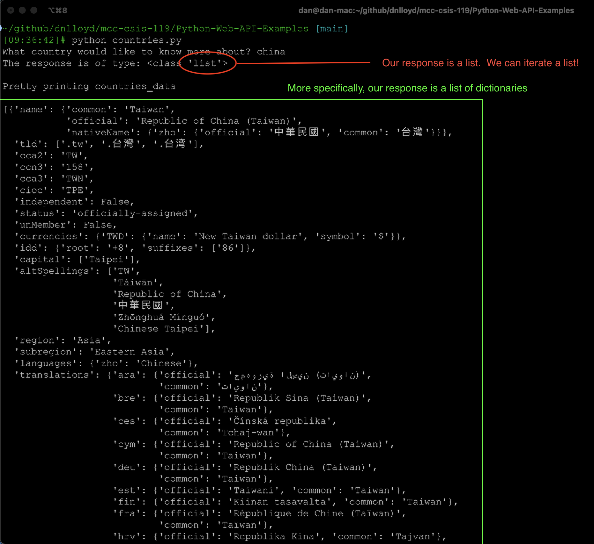

# Python Web API example: Countries

## 1. Initial run

**Code**: [countries-initial.py](countries-initial.py)

**Screen shot of output**



**Formatted output**: [countries_data-output.py](countries_data-output.py)

## 2. Final run

**Code**: [countries-final.py](countries-final.py)

**Output**

```
What country would like to search for? china
Found 4 countries
Taiwan
Hong Kong
China
Macau
```